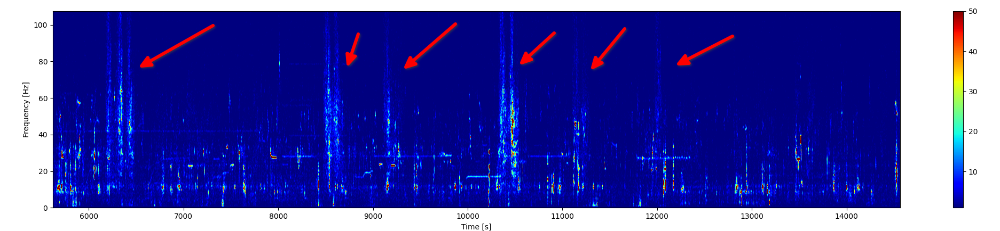

(Infrasound recordings of landing airplanes at Stuttgart Airport (EDDS). Vertical distance roughly 3000 meters.)

## What is this thing?

This is an extremely sensitive infrasound microphone based on the differential pressure sensor Sensirion SDP600-25Pa and an ESP32 microcontroller. It works up to a sampling rate of 100Hz (=50hz usable range) and has a 13 Bit resolution.

## How does this thing work?

1. It connects to a Wifi accesspoint 
2. Initializes the SDP600-25Pa sensor
3. Blasts out raw uint16_t measurement samples and their NTP synchronized timestamps as soon as you connect to the TCP port 1234

## How to get this thing running?

1. Modifiy the wifi.c to connect it to your local accesspoint

2. Compile it using VisualStudioCode and the ESP-IDF plugin

3. Use record-samples.py to save the measured samples to a file (e.q. examples.txt)

4. Use the show_* scripts to visualize them

## Hardware setup

Pin 21: SDA 

Pin 22: SCL

# Limitations

The I2C clock stretching capability of the ESP32 is limited.

The highest resolution you can choose is 13 Bit. Everything higher will lead to timeouts.

## License

GPLv3
